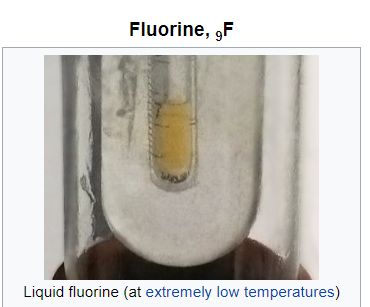
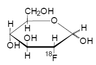
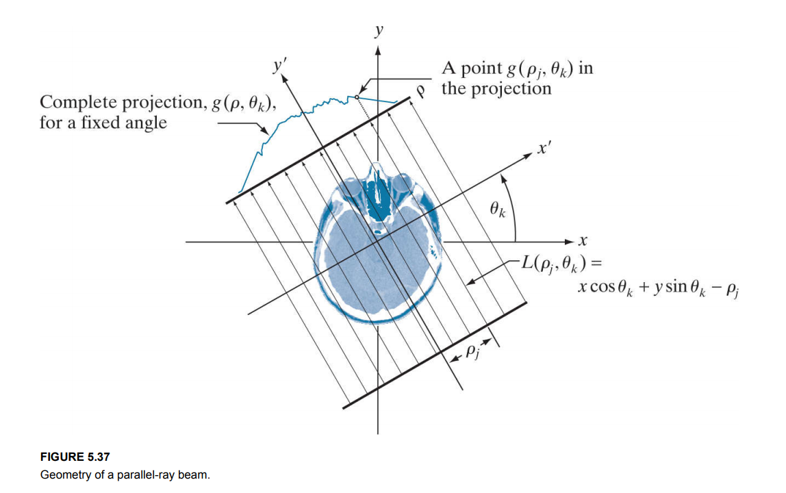
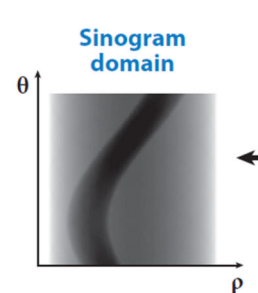
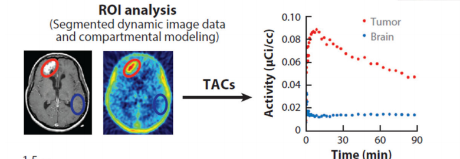

# PET脑部图像处理入门

@Author : 白皓天

@ID ：17121444

@Institution ： 上海大学计算机工程与科学学院

@Major ： 计算机科学与技术

大家好！本教程仅针对创新创业参与成员开放，希望技术人员迅速搭建编程环境，尽早进入项目探究与实验，腾出更多宝贵时间给经管同学参与到软件开发过程中来。语言较为粗浅，毕竟我是计算机专业的学生，对于物理，化学，生物这一块也只能算是查点资料，懂点皮毛，请见谅。

当然作为一个基本的介绍，我会就我目前的理解给大家再讲一下原理，一起加油吧！

---

写于成都

五一假期

## PET 是个啥

### 试剂中的氟

上面的黄色东西就是液态的氟，作为他的兄弟**Fluorine-18** (18F) 是正电子的主要来源，为什么呢？因为每隔20分钟，它的数量就得减少到原来的一半，并且97%的时间都在释放正电子。【这里发生了质子向中子的转化，$proton^+ \to neutron +e^+ $】

于是乎。。。

他变成了别人家的孩子了！

然而，才逃出来的正电子只走了1-2mm，就被外层的电子挡住了。

所谓正负水火不相容，砰的一下，瞬即湮灭。质能守恒，两颗高能光量子被弹出，以相反方向逃逸。

由于这个过程随时都可能在发生（衰变），那么可以认为光量子是以流的形式发出的【大概是几纳秒一次】。

病人呢？得安安静静地躺在一个桶里面，外面的一圈环就是接收器，用于捕捉接收到地光量子信号。每一个接受器都是由固定大小的元件组成的，在这个长方体中所有衰变粒子，湮灭后产生的线性信号就被这样收集起来，形成了组成PET图像的基础。

### 图像

病人在进行PET检测的时候就会注射带有上面提到的带有**Fluorine-18**的脱氧葡萄糖试剂【Fludeoxyglucose F 18 Injection (fdg)】

这一种试剂会参与人体的各种代谢活动，又由于试剂放射出信号的强弱与试剂的量是成正比的，因此如果人的某一个部位代谢旺盛，那么这里的试剂即脱氧葡萄糖FDG会多一些，自然信号也要强一些；同理，信号弱则说明代谢弱。

上面是补充，现在到图像啦！

接着上面说，自感受器接收到光量子信号之后，总需要一种方式将这些信号转化为图像吧[2]，一圈一圈的感受器怎么将这些线性的信号转化为我们能够看到和处理的图像呢？

我们来看这条线（可以理解为光量子所构成的直线模型），其实由于衰变的随机性，巧合性，病人不自觉地摇动（比如自己举起手，悬空试试，真的能保证手臂是笔直不动的吗），仪器的时效性等等[这里按照影响效果的大小排序]，这些东西我们暂时不考虑，先默认F18中的质子完美的释放出了正电子，这家伙也恰好碰到了外围的死敌：负电子，两个打架后变成两个光子分道扬镳，这个过程一切顺利地话，那么上面这条线就会出现在仪器接收器里面。

这个线的数学公式可以由如下形式表示（因为这里的仪器是个圆筒，所以用这个方式可以对参数$\Theta$赋予旋转角度$\rho$赋予距离中心准线距离的几何意义）。
$$
x\cos\theta +y\sin\theta=\rho
$$
那多条线会怎样呢？

我们想象一下，用一个刀片把脑子剖开（有点残忍哈哈），如上图我们设f(x,y)为一个随着时间连续变化的信号量强度，那么利用对f(x,y)的一个线性积分可以得到一个映射点：【$\delta$这个参数表示脉冲，现在不用理解，我也还没看，嘻嘻】
$$
g(\rho_j,\theta_k) = \int_{-\infty}^{+\infty}\int_{-\infty}^{+\infty} f(x,y)\delta(x\cos\theta +y\sin\theta-\rho)\mathrm{d}x\mathrm{d}y
$$
简单说下，虽然对我自己言，没有真正地把微积分方面的东西搞透彻，但基本还是可以解释一下的。这里面运用了在x，y平面对于直线$x\cos\theta +y\sin\theta=\rho$进行积分，其目的在于将这条线上的所有点信号统一起来，这样不就得到了一个位置的投影了么？

上述（2）式中的变换过程为Radon transform，这也是CT，SPECT，PET，MRI投影的基本原理。

在这个只是个横截面的情况下，我们可以之后，通过上下移动的方式，将其拓展到二维的情况，就能得到脑部的一个视图（视图也就是说，我从一个特定的视角去看这个物体，更为准确的是三维物体向二维平面的投影）。如果再加上旋转呢？

仅需要[0,180]°的扫描就可以完成全部操作，上图x表示垂直直面的，可以理解为一个人的脑袋，身子躺在了圆桶中，而外面一圈就是5000左右的感受器，用于收集衰变产生的光量子信号。

这就可以得到一个三维的图像了。

## 图像预处理与特征区域提取

这个步骤使用的SPM12，一款专业的图像处理软件做的，其目的就是为了解决上面提到的，包括随机性，病人移动等因素造成的图像噪声；同样还有动态粒子与解剖图像相结合的部分，这里我自己还没有搞得很懂，充其量会用软件罢了。所以这个部分打算今后用到的时候再去搞清楚。

像这里的Imager model 就是经过大量解剖数据收集得到的人脑模型，在SPM12中还对欧洲，亚洲人中进行了区分，于是经过解剖图像与信号图像结合，就得到了PET图像；在现代PET研究中，人们发现，如果结合MRI，核磁共振，会有更加好的效果，但是我们没有MRI图像，所以就这样吧。。。哈哈。

这套软件用下来的效果是很大的，因为你想，病人和普通人不同的地方，需要利用统计学的一些方法，如样本T检测标志出来，在得到纯净的，经过人脑解剖图像校准后的PET图像，还需要进行如ROI（Rigion of Interest）即特征区域的提取，只有这样我们才能知道需要研究的地方在哪。

从这里可以看到，其实我们研究一个疾病的时候，很多数据可以像这样可视化出来，这样就极大地方便了工作人员（他们就是我们软件的用户）来观察这个结果，节省了他们熟悉复杂软件的大量时间。

上图是研究脑瘤的实验，还记得上面的原理吗？PET的信号是由衰变进行输出的，那么这些粒子都是动态的，所以一定有一个时间参数，反应一系列的变化过程，上述实验非常明显可以看出，脑瘤，即肿瘤细胞，消耗了极多的FDG分子，也锁定了区域，方便临床诊疗和疾病研究。

另外，这款专业软件可以做的还不仅仅如此，我对SPM12的使用还停留在做简单的ROI特征区域提取阶段，在软件内部还有一个动力学模型，这个模型呢，接受上面的随时间变化的动态信息后，再配置每个组织特有的参数，就可以对接下来的生理情况进行预测，十分强大，我还没有充分理解这一块，但大家可以先明白这个东西可以做到什么。

这样的图像经过特征区域比较，即T检测分析后，我们就可以标出下图所示的红蓝区域，这个结果也是结合了华山医院提供的26组正常人和18组精神分裂症患者的比对结果。

这一张图片，就是经过了上述那么多过程的结果啦！感谢耐心读完，虽然有很多数学，物理，化学的知识，但是相信你读到这里，对它从怎么来，到之后有什么用都有了充分的了解（嘻嘻），那么对于包括后续图像处理，产品的推广，你也不会感到非常迷茫；毕竟这样的医学项目，离我们大多数人，我们本科生有着较远的距离。可是，这么发达的信息社会，资料其实是很多的，所以大家有耐心，有信心的话，我们一定能做好的！

## 技术员起飞

写在前面：这一篇是专门为CJY,LL两位一起做图像的小伙伴写的；当然，现在程序，怎么说呢，在我个人观点来看，是一个在不久后人人必须会一点的东西，金融中，大如股市，银行管理系统；小如一个随时可以自己可视化数据，筛选，分析数据的技术；当然对于生命科学也是如此，我好几次在生命学院数据的处理，也发现其实很多时候只需要一些简单的技巧与耐得住寂寞的心，无论什么数据都能找到有效的处理方法。

大致就这么多，不罗嗦了，感兴趣的同学可以和我一起来学学python。

### 什么是程序

这一块，我思索了一段时间，我还是很想加上的，因为不光是为了让非计算机相关专业的同学理解计算机的工作，同时也是我自己对两年来接触程序的一些思考。以下均为个人观点，勿喷。

程序，大家看到程序员做的，无非是电脑前敲敲敲，然后写一些app，网站之类的给大家用。的却，很多时候是这样的，但是呢，远非如此。

程序，就是人和计算机的交流，因为计算机是冷冰冰的硬件，没有一个非常规范化的语言去协调那样复杂的电路的运行，是不可能的。计算机之所以能够运行，包括你能够输入一行字，正确地显示在你需要的位置，那都是一堆电路和逻辑在内部辛勤工作的结果，可得好好感谢他们！

### 算法what？

大家现在听的最多的就是这个词了，怎么说呢，自从人工智能相关的领域兴起后，大量的知识，一说到人工智能，计算机，都是XXX使用了XX算法，其实没那么复杂。

算法就是做一个事情的步骤，最简单的莫过于你现在都这篇文稿，你的命令你的眼睛扫一下这个字，然后手指头往下滑动，那么，这才能够继续读呢。所以大概就两部，看和操作。

这就是一个算法呀，没有错。

只不过随着大量数学研究，统计学，生物学，一堆东西加入后，这个世界变得复杂了起来，但也强大了起来。计算机凭借着其高速的运行速度，只要程序写到位，理论上能够解决的问题，都能得到输出，给与人们实验数据和分析。

接下来，所用的算法其实大部分都被pyradiomics写好了，所以理解上也不困难。但我希望之后我们能想出更好的方法，至少有自己的创新点。这样老师们也不会拿这一块，来戳我们了，呵呵！

### 为啥python

在当前，主流的三大语言，python，java，c++中python是一种解释性语言；它具有软件包极为丰富，安装极为便利，对数据处理极为主流的优势，固然也是有缺点的，例如执行速度慢。但是考虑到我们的项目数据量不多，而且需要强力计算的部分都在SPM中做掉了，那也不用那么快的速度；其次呢，我找到一个非常对口的影像学处理的包pyradiomics，前期工作已经尝试过了，也就不太想换了。

### 配环境

公欲成其事，必先利其器。学了计算机快两年的我，到现在，任然对配环境这件事深感头疼，但我头疼的范围要少一些，仅限于那种资料又少，环境极端不友好的情况。像Anaconda这种顶顶大名的包管理工具，教程无数。

这里就不细写了，给个网站，我看了看还不错：

https://www.cnblogs.com/maxiaodoubao/p/9854595.html

有两点值得注意：

* 别忘了加环境变量
* 记得更换国内的源

上面这两点，那个网站里都有。

还有一点，不要将这要的包装在C盘，选择另外个地址。

### 正式开始

资料我已经整合过放在OneNote里了，请自行打开：

打开后你会看到这样的文件，然后请复制这个地址，按住win+R打开命令行，输入cmd

1. 

2.

3. 输入cd 空格 + 复制地址

输入盘号跳转，如我这里是D，那么输入D：

4. 输入jupyter notebook 

给大家稍微介绍下这个notebook，这是一个可互动式的编程环境，其原理是利用虚拟机进行代码编译与执行，最大的优点是互动性，也就是说你想测试下这个数据，不用运行整个程序，简单的跑个小段就好了，而且展示和交流也十分方便。

feature extraction.ipnb点进去我们正式开始！

如果大家遇到这个问题，是因为jupyter权限不足：

请用

这个方式打开cmd

### 代码分析

其实吧，我这个算是模仿着pyradiomics的官方样本做的，所以我也只是讲讲每一步干了啥，我自己理解的还不够深入，因为这里面也有大量的数学公式，和算法值得研究。我自己有个习惯，决定要做的东西，我一般会搞清楚原理，一是为了让自己有动力做下去，二是为自己增加能力。

https://pyradiomics.readthedocs.io/en/latest/ 这是他们官网，很多信息，我还在摸索中。

来到这个页面后，我们会看到一个大大的脑袋图，上面工具栏有书签，记得展开哦！

## 参考资料

[1]Vaquero JJ, Kinahan P. Positron Emission Tomography: Current Challenges and Opportunities for Technological Advances in Clinical and Preclinical Imaging Systems. *Annu Rev Biomed Eng*. 2015;17:385‐414. doi:10.1146/annurev-bioeng-071114-040723

[2]Gonzalez, Rafael C._ Woods, Richard E. - Digital image processing (2018, Pearson) - libgen.lc

[3]Hello World! Computer Programming for Kids and Other Beginners, Warren and Carter Sande